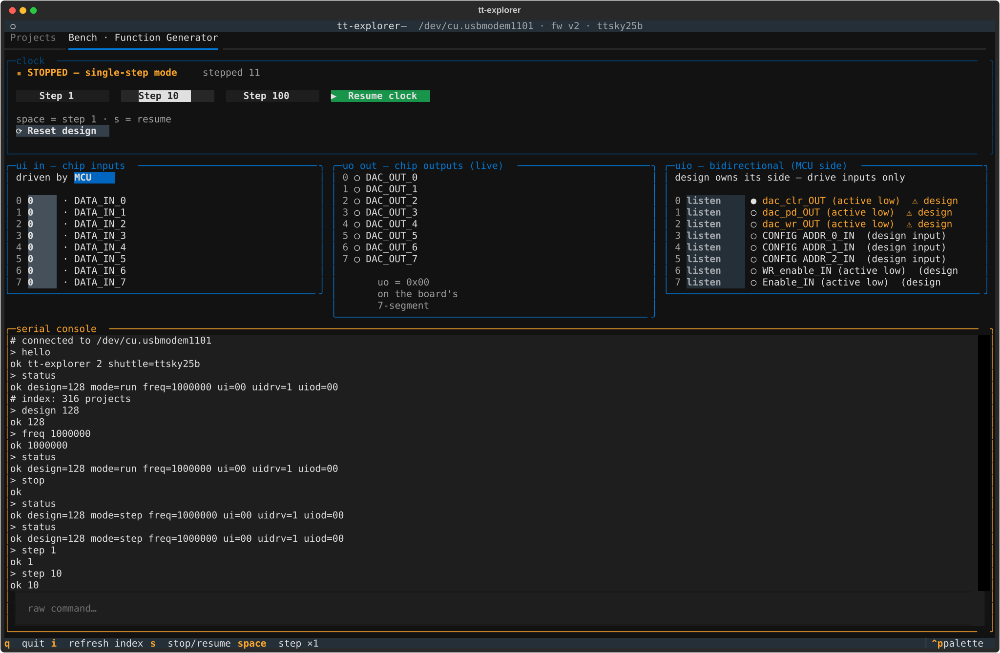
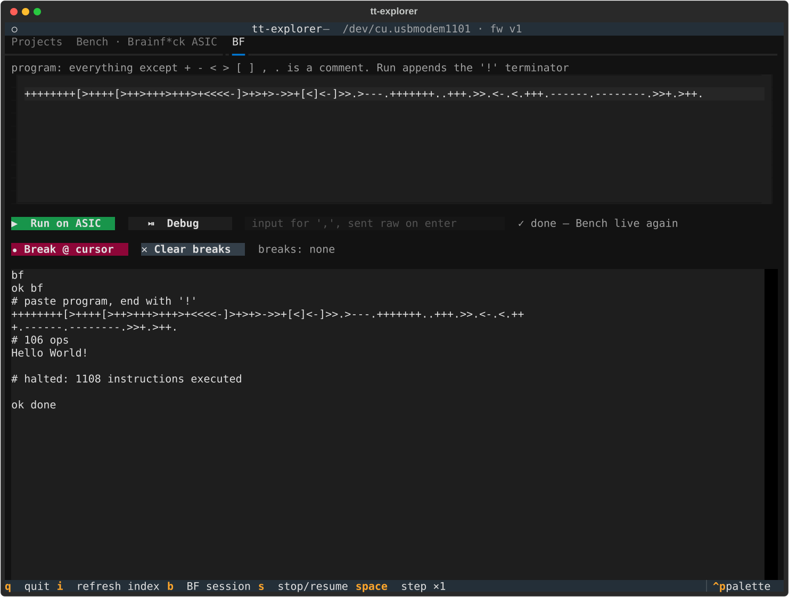
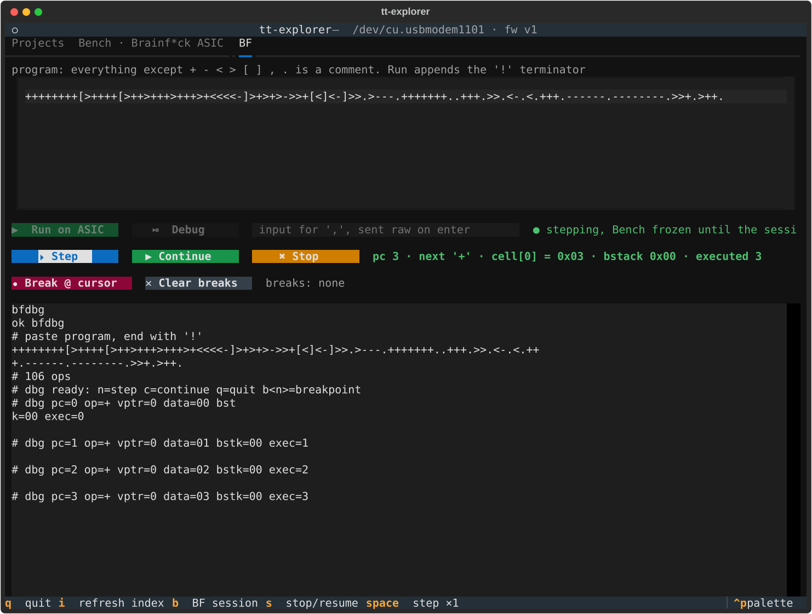
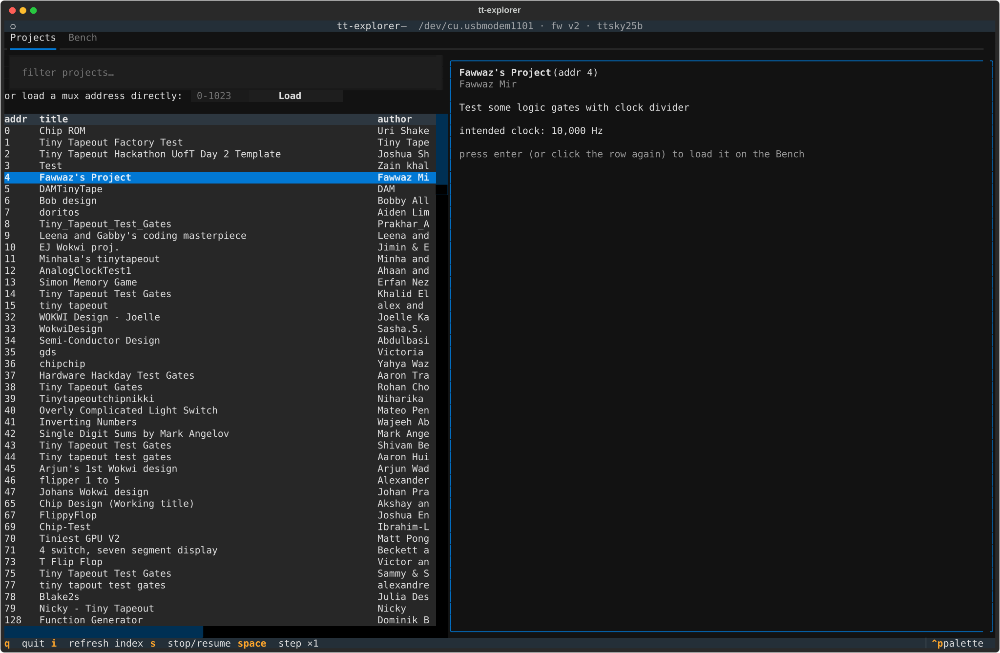

# tt_terminal_explorer

A [Tiny Tapeout](https://tinytapeout.com) shuttle chip carries
hundreds of small hardware designs on one die. Only one design is
active at a time: an on-chip multiplexer selects it, and the demo
board's RP2350 microcontroller controls that multiplexer, the
design's clock, and all of its pins.

This project turns the demo board into an interactive lab bench for
whatever shuttle chip sits on it. You browse the designs in a
terminal UI, load one onto the chip, clock it at any speed or step
it one pulse at a time, drive its inputs, and watch its outputs
live. Tested on ttsky25a and ttsky25b chips.

The project has two parts:

- **firmware/** builds `tt_host.uf2` for the board's RP2350. It
  serves a small, human-readable command protocol over USB serial:
  select a design through the project mux, control the clock, and
  read or drive the pins. A bare terminal (`tio`, `screen`) can use
  it directly.
- **explorer/** is the terminal UI (Python,
  [Textual](https://textual.textualize.io)). It communicates over
  the protocol and adds the shuttle index: titles, descriptions,
  and pin names for every design.



## Capabilities

- Browse and filter all shuttle projects, or load a mux address
  directly.
- Select a design: the board switches the mux, resets the project, and
  sets the design's intended clock.
- See every pin live, one labeled row per pin, with the design's own
  pin names. A mirror of the board's 7-segment display shows what the
  hardware shows.
- Drive the inputs from the TUI, or release the bus so the DIP
  switches / PMOD drive them.
- Set the uio direction per pin. Rows show a direction hint parsed
  from the design's pin names, and pins that look like design outputs
  get a warning tag before you drive them.
- Set the project clock, or stop it and step one pulse at a time.
  With the C firmware the clock is PIO-generated: 1 Hz to 75 MHz,
  exact to one sys-clock cycle, never above the requested
  frequency.
- Detect what sits on the board at boot (chip carrier, FPGA
  breakout, or nothing) and show it in the UI.
- Work with both firmwares. The UI detects whether the board runs
  the stock Tiny Tapeout MicroPython firmware or this repo's C
  firmware, and uses the matching protocol.

## What you need

Hardware: a Tiny Tapeout demo board with a shuttle chip, and a USB
cable.

Software, for the terminal UI:

- [uv](https://docs.astral.sh/uv/). It downloads Python and the
  dependencies for you, so no other Python setup is necessary.

  On macOS / Linux:
  ```sh
  curl -LsSf https://astral.sh/uv/install.sh | sh
  ```

  On Windows:
  ```powershell
  powershell -c "irm https://astral.sh/uv/install.ps1 | iex"
  ```

The firmware comes prebuilt: `tt_host.uf2` on the
[Releases](../../releases) page. You only need a firmware toolchain
to modify it (see "Build the firmware from source" below).

Optional: [picotool](https://github.com/raspberrypi/picotool) to
flash without touching the BOOTSEL button.

## Quickstart

The UI also communicates with the stock Tiny Tapeout MicroPython firmware that
ships on the board, so step 1 is optional: plug the board in and go
straight to step 2. Flash the C firmware when you want its exact
clock and extension hooks (see the next section).

1. Flash the firmware. Download `tt_host.uf2` from the
   [Releases](../../releases) page. Hold BOOTSEL, plug the board
   in, and copy the file to the `RP2350` drive that appears. Or:

   ```sh
   picotool load -x tt_host.uf2
   ```

2. Run the UI, naming the shuttle run your chip is from
   (`ttsky25a`, `ttsky25b`, ...). The UI downloads that shuttle's
   index from index.tinytapeout.com, which is where the project
   list, descriptions, and pin names come from:

   ```sh
   cd explorer
   uv run tt-explorer --shuttle ttsky25b   # or: export TT_SHUTTLE=ttsky25b
   ```

   The serial port is autodetected, and so is the firmware (by USB
   id). Use `--port /dev/tty...` to override the port. Pick a
   design from the list and press enter.

## Why the C firmware

The stock MicroPython firmware is a great lab assistant: a Python
REPL on the board, easy to poke by hand, and this UI drives it
fine for browsing designs, clocking them, and watching pins.

The C firmware is worth the one-time flash when timing starts to
matter:

- **Exact clock.** A PIO state machine makes the project clock:
  1 Hz to 75 MHz, exact to one sys-clock cycle, and never above
  the frequency you asked for. The stock firmware clocks with the
  PWM block: it bottoms out near 8 Hz and snaps to divider steps.
- **Fast, steady replies.** A command runs in microseconds of C,
  with no interpreter or garbage collector between you and the
  pads. Scripted interaction stays cycle-accurate: drive a pin,
  pulse the clock once, sample the result, repeat thousands of
  times.
- **A place for your own commands.** A design-specific command, or
  a whole raw byte-stream session (a program loader, a debugger),
  is one C function and one table row. See
  [docs/extending.md](docs/extending.md).

## What that unlocks: a worked example

This kit was extracted from
[tt_um_brainf-ck_asic](https://github.com/map588/tt_um_brainfck_asic),
a Brainf*ck computer on the same shuttle. Its firmware feeds the
chip one instruction per clock pulse through a bit-banged
handshake, mirrors the chip's program counter to stay in step,
emulates the SPI RAM tape on the RP2350's second core, and works
around four silicon bugs at exact clock edges. None of that fits
through a Python REPL at millisecond granularity.

On top of those firmware hooks, the UI grew a third tab. Programs
run on the real chip:



And an instruction-level debugger with breakpoints, stepping the
silicon one instruction at a time:



## Build the firmware from source

Only needed to modify the firmware. You need:

- The [pico-sdk](https://github.com/raspberrypi/pico-sdk), 2.0 or
  newer:

  ```sh
  git clone --branch master https://github.com/raspberrypi/pico-sdk.git ~/pico-sdk
  git -C ~/pico-sdk submodule update --init lib/tinyusb
  export PICO_SDK_PATH=~/pico-sdk
  ```

  tinyusb is the one SDK submodule USB serial needs. Do not clone
  with `--recurse-submodules`: that pulls every nested submodule,
  most of a gigabyte you do not need.
- The [Arm GNU toolchain](https://developer.arm.com/downloads/-/arm-gnu-toolchain-downloads)
  (`arm-none-eabi-gcc`). Use Arm's official release or the one the
  [Pico VS Code extension](https://marketplace.visualstudio.com/items?itemName=raspberry-pi.raspberry-pi-pico)
  installs (`~/.pico-sdk/toolchain/...`). The Homebrew
  `arm-none-eabi-gcc` package does not work: it lacks newlib and
  fails with `cannot read spec file 'nosys.specs'`.
- `cmake` (3.13 or newer) and `ninja`. On macOS:
  `brew install cmake ninja`.

Then:

```sh
cd firmware
cmake -S . -B build -G Ninja
cmake --build build
```

If cmake does not find your cross compiler, point at it:
`cmake -S . -B build -G Ninja -DPICO_TOOLCHAIN_PATH=<toolchain dir>`.
The image is `build/tt_host.uf2`.

## Adapt it to your design

This repo is a starter kit. To add your own firmware commands,
copy [firmware/example](firmware/example): a complete minimal
extension you can build, flash, and rename. The UI side is one
obvious place per addition: a panel, a tab, a protocol parser.
[docs/extending.md](docs/extending.md) describes both sides, and
links a complete worked example at the end.



## Keys

- `s` : stop / resume the project clock
- `space` : one clock pulse (when stopped)
- `i` : refresh the shuttle index (cached in `~/.cache/tt-explorer/`)
- `q` : quit

## How pin control works

The UI, UO, and UIO busses are shared on the same nets.

- `uo_out` is always driven by the design. Everything else listens.
- `ui_in` is driven by the firmware, or released so the DIP switches
  or a PMOD can drive it.
- `uio` direction is controlled per pin by the design itself
  (`uio_oe`). The TUI sets only the MCU side. Drive only the pins the
  design's pinout declares as its inputs. The firmware releases all
  uio pins each time you switch designs, so the default is always
  safe.

## Protocol

See `firmware/README.md` for the command table. The protocol is
simple and can be written by hand.

## License

Apache-2.0. Built around the [Tiny Tapeout](https://tinytapeout.com)
demo board and shuttle index.
